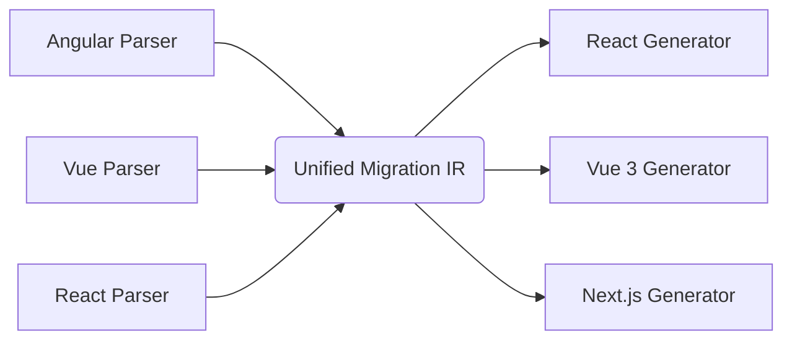

# 🔄 Unified Migration IR (Intermediate Representation)

This package implements the **Pivot Intermediate Representation (IR)** for the Code Migration Tool. 

Rather than executing tight-coupling transformations (e.g. compiling Vue AST directly to React code), the compiler acts as a decoupled two-pass translation engine:
1. **Parsers** ingest Angular/React/Vue components and compile them into a unified, framework-agnostic **`UnifiedModuleIR`**.
2. **Generators** ingest the **`UnifiedModuleIR`** and output target code matching framework-specific patterns.

---



---

## 📦 Intermediate Representation Structure

The IR is comprised of the following key structures:

*   **`UnifiedModuleIR`**: Root container for files, containing absolute/relative paths, [imports](file:///d:/ashif/Resume%20Projects/migration-tool/packages/backend/src/ir/types.ts#L7), [exports](file:///d:/ashif/Resume%20Projects/migration-tool/packages/backend/src/ir/types.ts#L12), [routing configuration](file:///d:/ashif/Resume%20Projects/migration-tool/packages/backend/src/ir/types.ts#L86), and a list of components.
*   **`UnifiedComponentIR`**: Describes component boundaries, including props, state, methods, lifecycles, and styles.
*   **`UnifiedTemplateNode`**: A node tree representing UI structures (e.g. tags, loops, attribute bindings, conditionals, text, child bindings).

---

## 🛠️ Developer Usage Example

### 1. Fluent Builder
Construct a compiler IR programmatically:
```typescript
import { UnifiedModuleBuilder, UnifiedComponentBuilder } from "./builder";

const component = new UnifiedComponentBuilder("HeroWidget")
  .addProp("title", "string", "'Hero'", false)
  .addState("count", "number", "0")
  .addMethod("increment", [], "void", "this.count++")
  .addLifecycle("mount", "console.log('Hero mounted');")
  .setTemplate({
    type: "element",
    name: "div",
    attributes: [{ name: "class", value: "container" }],
    events: [],
    children: [
      {
        type: "text",
        name: "",
        attributes: [],
        events: [],
        children: [],
        textContent: "Title: {title}"
      }
    ]
  });

const moduleIR = new UnifiedModuleBuilder("/src/Hero.ts", "src/Hero.ts")
  .addImport("react", [{ name: "useState", isDefault: false }])
  .addComponent(component)
  .build();
```

### 2. Validation
Check structural validity:
```typescript
import { UnifiedIRValidator } from "./validator";

const result = UnifiedIRValidator.validate(moduleIR);
if (!result.valid) {
  console.error("Invalid IR structure:", result.issues);
}
```

### 3. Serialization
Format and output JSON:
```typescript
import { UnifiedIRSerializer } from "./serializer";

// Serialize to JSON
const json = UnifiedIRSerializer.serialize(moduleIR);

// Deserialize from JSON
const restoredIR = UnifiedIRSerializer.deserialize(json);
```
